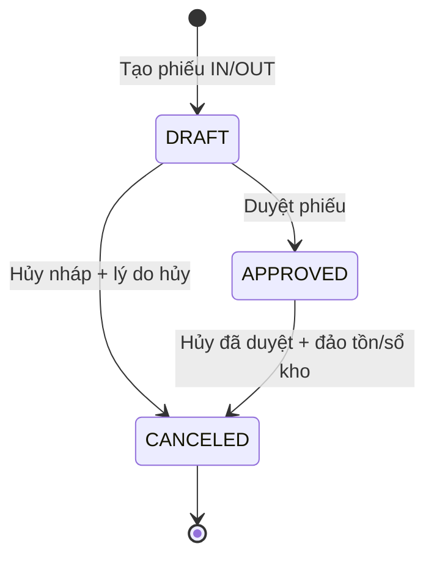
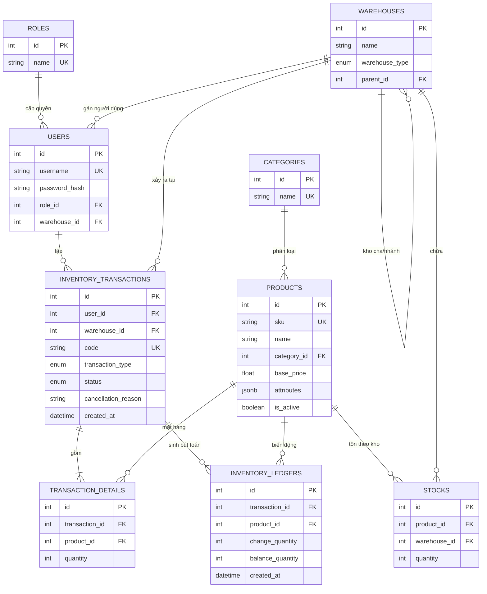

# WMS System — Hệ thống quản lý kho

Ứng dụng web quản lý dữ liệu kho, sản phẩm và nghiệp vụ nhập/xuất hàng. Hệ thống cho phép lập phiếu nháp, duyệt để cập nhật tồn kho một cách nhất quán, hủy phiếu để hoàn tồn (khi hợp lệ), và lưu vết biến động trong sổ kho.

> Tài liệu này mô tả đúng phiên bản mã nguồn hiện có. Những giới hạn triển khai hoặc điểm cần lưu ý được nêu rõ ở phần [Lưu ý kỹ thuật](#lưu-ý-kỹ-thuật-và-giới-hạn-hiện-tại).

## Mục lục

- [Kiến trúc và công nghệ](#kiến-trúc-và-công-nghệ)
- [Chức năng](#chức-năng)
- [Luồng nghiệp vụ nhập/xuất](#luồng-nghiệp-vụ-nhậpxuất)
- [Cơ sở dữ liệu](#cơ-sở-dữ-liệu)
- [API](#api)
- [Cài đặt và chạy dự án](#cài-đặt-và-chạy-dự-án)
- [Lưu ý kỹ thuật](#lưu-ý-kỹ-thuật-và-giới-hạn-hiện-tại)

## Kiến trúc và công nghệ

```text
React + Vite + Tailwind CSS
          │ HTTP (Axios, Bearer JWT)
          ▼
FastAPI + SQLAlchemy ─────────► PostgreSQL
          │                         │
          └─ JWT / bcrypt            └─ JSONB, enum, pg_trgm index
```

| Khu vực | Công nghệ | Vai trò |
| --- | --- | --- |
| Frontend | React 18, Vite 5, React Router 6 | Single-page application và định tuyến màn hình |
| Giao diện | Tailwind CSS, Lucide React | Kiểu dáng và biểu tượng |
| Gọi API | Axios | Gắn tự động Bearer token, đưa về trang đăng nhập khi nhận `401` |
| Backend | FastAPI, Uvicorn | REST API, xác thực và xử lý nghiệp vụ |
| ORM | SQLAlchemy 2 | Ánh xạ mô hình Python với PostgreSQL |
| CSDL | PostgreSQL | Lưu master data, tồn kho, chứng từ và sổ kho |
| Bảo mật | python-jose, passlib/bcrypt | JWT và băm mật khẩu |

Mã nguồn được tách thành hai ứng dụng:

```text
warehouse_system/
├── backend/
│   ├── app/
│   │   ├── api/          # FastAPI routers và dependencies xác thực
│   │   ├── crud/         # Truy vấn và nghiệp vụ dữ liệu
│   │   ├── models/       # SQLAlchemy models
│   │   ├── schemas/      # Pydantic request/response schemas
│   │   ├── core/         # JWT, bcrypt
│   │   ├── db/           # Engine và session PostgreSQL
│   │   └── main.py       # Khởi tạo FastAPI và tạo bảng
│   ├── requirements.txt
│   └── .env.example
└── frontend/
    ├── src/pages/        # Các màn hình React
    ├── src/services/     # Axios services theo từng module
    ├── src/App.jsx       # Routes và protected routes
    └── .env.example
```

## Chức năng

### 1. Đăng nhập và phiên làm việc

- Đăng nhập bằng `username` và `password` qua OAuth2 password form.
- Backend xác thực mật khẩu bcrypt, sau đó trả access token JWT. Thời hạn token lấy từ `ACCESS_TOKEN_EXPIRE_MINUTES` (mẫu cấu hình là 1.440 phút).
- Frontend lưu `access_token`, `user_role`, `username` trong `localStorage`.
- Các route giao diện chính yêu cầu token; khi API trả `401`, token cũ bị xóa và người dùng được chuyển đến `/login`.
- API `GET /api/auth/me` trả `id`, `username`, `role_id` của tài khoản đang đăng nhập.

### 2. Danh mục

- Tạo và liệt kê danh mục sản phẩm.
- Tên danh mục là duy nhất.
- Xóa danh mục chỉ dành cho role có `role_id = 1` (Admin).
- Không thể xóa danh mục còn sản phẩm tham chiếu đến nó; API trả lỗi `400` thay vì làm mất dữ liệu liên quan.

### 3. Sản phẩm

- Tạo, xem chi tiết, cập nhật và quản lý sản phẩm theo SKU duy nhất.
- Mỗi sản phẩm thuộc một danh mục, có giá cơ bản và tập thuộc tính linh hoạt (`attributes`) lưu dưới dạng JSONB, ví dụ: màu sắc, quy cách hoặc trọng lượng.
- Tìm theo một phần tên, lọc theo danh mục, lọc trạng thái và sắp xếp theo giá tăng/giảm.
- Danh sách phân trang 10 bản ghi/trang trên giao diện; API hỗ trợ kích thước trang từ 1 đến 100.
- Xóa là **soft delete**: chỉ đặt `is_active = false`, không xóa dòng trong CSDL để giữ lịch sử giao dịch. Sản phẩm trong “thùng rác” có thể được khôi phục.
- Bộ lọc và trang hiện tại được đồng bộ vào query string của URL để có thể chia sẻ/khôi phục trạng thái xem.

### 4. Kho

- Tạo và xem danh sách kho.
- Có hai loại kho: `CENTRAL` (kho tổng) và `BRANCH` (kho nhánh).
- Kho nhánh có thể tham chiếu `parent_id` đến một kho tổng; giao diện yêu cầu chọn kho tổng khi tạo kho nhánh.
- Danh sách kho được tái sử dụng trong màn hình tồn kho, lập phiếu và quản lý người dùng.

### 5. Tồn kho

- Tra cứu tồn theo từng cặp sản phẩm–kho.
- Tìm theo tên sản phẩm (không phân biệt hoa/thường), lọc theo kho, sắp xếp số lượng tăng/giảm và phân trang 10 dòng/trang.
- Số lượng tồn không được sửa trực tiếp từ UI/API. Nó chỉ thay đổi khi duyệt hoặc hủy phiếu đã duyệt, giúp giữ được chứng từ nguồn.
- Trạng thái tồn bằng hoặc dưới 0 được hiển thị cảnh báo trên giao diện.

### 6. Phiếu nhập/xuất và sổ kho

- Lập phiếu nhập (`IN`) hoặc xuất (`OUT`) dưới trạng thái `DRAFT`.
- Chọn một kho, tìm sản phẩm theo tên và thêm nhiều dòng hàng vào cùng một phiếu. Chọn lại sản phẩm sẽ cộng thêm 1 vào số lượng dòng hiện có.
- Mỗi phiếu được tạo mã theo thời điểm: `INyyyyMMddHHmmss` hoặc `OUTyyyyMMddHHmmss` (giờ Việt Nam, UTC+7).
- Duyệt phiếu để cập nhật tồn và tạo một dòng sổ kho cho mỗi chi tiết hàng.
- Hủy phiếu nháp không làm biến động tồn; hủy phiếu đã duyệt sẽ tạo các bút toán đảo và hoàn lại tồn nếu còn đủ điều kiện.
- Xem lịch sử theo trạng thái (`DRAFT`, `APPROVED`, `CANCELED`) và khoảng ngày; kết quả mới nhất hiển thị trước.
- Mỗi phiếu trả về cả các dòng hàng, tên sản phẩm và lý do hủy (nếu có).

### 7. Tài khoản và quyền

- Admin (`role_id = 1`) có menu quản lý tài khoản, được xem/tạo người dùng và xóa danh mục.
- Staff (`role_id = 2`) không thấy menu tài khoản trên giao diện.
- Khi tạo người dùng, mật khẩu được băm bằng bcrypt; không bao giờ trả `password_hash` qua API.
- Bảng `roles` là dữ liệu quyền gốc; giao diện và dependency hiện quy ước ID `1` là Admin, `2` là Staff.

### 8. Dashboard

Trang `/dashboard` đang là trang tổng quan trạng thái tĩnh của WMS. Chưa có API hoặc số liệu thống kê/báo cáo động.

## Luồng nghiệp vụ nhập/xuất

### Vòng đời phiếu



| Thao tác | Điều kiện chính | Tác động đến `stocks` | Tác động đến `inventory_ledgers` |
| --- | --- | --- | --- |
| Tạo nháp | Kho tồn tại; cần token | Không thay đổi | Không tạo dòng |
| Duyệt `IN` | Phiếu phải là `DRAFT` | Cộng tồn; tạo dòng tồn nếu sản phẩm chưa có tại kho | Ghi `change_quantity` dương và số dư sau cộng |
| Duyệt `OUT` | Phiếu phải là `DRAFT`; tồn phải đủ | Trừ tồn | Ghi `change_quantity` âm và số dư sau trừ |
| Hủy nháp | Phiếu chưa hủy | Không thay đổi | Không tạo dòng |
| Hủy `IN` đã duyệt | Tồn hiện có phải đủ để trừ lại lượng đã nhập | Trừ tồn | Ghi bút toán âm đảo nhập |
| Hủy `OUT` đã duyệt | Phiếu chưa hủy | Cộng tồn | Ghi bút toán dương đảo xuất |

Khi duyệt/hủy, backend đọc khóa (`SELECT ... FOR UPDATE`) phiếu và bản ghi tồn liên quan trước khi tính toán. Nhờ đó các thay đổi trong một lần xử lý được commit cùng nhau; xuất vượt tồn sẽ bị từ chối thay vì tạo số âm từ luồng duyệt phiếu.

## Cơ sở dữ liệu

### Sơ đồ quan hệ (ERD)



### Đặc tả từng bảng

#### `roles`

| Cột | Kiểu | Ràng buộc | Ý nghĩa |
| --- | --- | --- | --- |
| `id` | `INTEGER` | PK, index | Định danh role |
| `name` | `VARCHAR` | NOT NULL, UNIQUE | Tên role |

Quy ước giao diện/API hiện tại: `1 = Admin`, `2 = Staff`.

#### `warehouses`

| Cột | Kiểu | Ràng buộc | Ý nghĩa |
| --- | --- | --- | --- |
| `id` | `INTEGER` | PK, index | Định danh kho |
| `name` | `VARCHAR` | NOT NULL | Tên kho |
| `warehouse_type` | PostgreSQL enum | NOT NULL | `CENTRAL` hoặc `BRANCH` |
| `parent_id` | `INTEGER` | FK → `warehouses.id`, nullable | Kho cha; dùng để biểu diễn kho nhánh |

`parent_id` là khóa ngoại tự tham chiếu. Model cho phép một kho có nhiều kho nhánh và mỗi kho nhánh có tối đa một kho cha.

#### `users`

| Cột | Kiểu | Ràng buộc | Ý nghĩa |
| --- | --- | --- | --- |
| `id` | `INTEGER` | PK, index | Định danh người dùng |
| `username` | `VARCHAR` | NOT NULL, UNIQUE, index | Tên đăng nhập |
| `password_hash` | `VARCHAR` | NOT NULL | Mật khẩu đã băm bcrypt |
| `role_id` | `INTEGER` | NOT NULL, FK → `roles.id` | Role của tài khoản |
| `warehouse_id` | `INTEGER` | NOT NULL, FK → `warehouses.id` | Kho trực thuộc |

#### `categories`

| Cột | Kiểu | Ràng buộc | Ý nghĩa |
| --- | --- | --- | --- |
| `id` | `INTEGER` | PK, index | Định danh danh mục |
| `name` | `VARCHAR` | NOT NULL, UNIQUE | Tên danh mục |

#### `products`

| Cột | Kiểu | Ràng buộc | Ý nghĩa |
| --- | --- | --- | --- |
| `id` | `INTEGER` | PK, index | Định danh sản phẩm |
| `sku` | `VARCHAR` | NOT NULL, UNIQUE | Mã hàng duy nhất |
| `name` | `VARCHAR` | NOT NULL | Tên sản phẩm |
| `category_id` | `INTEGER` | NOT NULL, FK → `categories.id` | Danh mục |
| `base_price` | `FLOAT` | NOT NULL | Giá cơ bản |
| `attributes` | `JSONB` | Default `{}` | Thuộc tính tùy biến theo sản phẩm |
| `is_active` | `BOOLEAN` | NOT NULL, default `true` | Cờ kinh doanh/soft delete |

Ngoài khóa chính, bảng có GIN trigram index `ix_product_name_trgm` trên `name` để hỗ trợ truy vấn tên gần đúng/`ILIKE` khi PostgreSQL có extension `pg_trgm`.

#### `stocks`

| Cột | Kiểu | Ràng buộc | Ý nghĩa |
| --- | --- | --- | --- |
| `id` | `INTEGER` | PK, index | Định danh dòng tồn |
| `product_id` | `INTEGER` | NOT NULL, FK → `products.id` | Sản phẩm |
| `warehouse_id` | `INTEGER` | NOT NULL, FK → `warehouses.id` | Kho đang giữ hàng |
| `quantity` | `INTEGER` | NOT NULL | Số lượng tồn hiện tại |

Một dòng biểu diễn tồn của một sản phẩm tại một kho. Nghiệp vụ duyệt phiếu giả định mỗi cặp `(product_id, warehouse_id)` chỉ có một dòng.

#### `inventory_transactions`

| Cột | Kiểu | Ràng buộc | Ý nghĩa |
| --- | --- | --- | --- |
| `id` | `INTEGER` | PK, index | Định danh phiếu |
| `user_id` | `INTEGER` | NOT NULL, FK → `users.id` | Người lập phiếu |
| `warehouse_id` | `INTEGER` | NOT NULL, FK → `warehouses.id` | Kho nhập/xuất |
| `code` | `VARCHAR` | NOT NULL, UNIQUE, index | Mã phiếu tự sinh (`IN...`/`OUT...`) |
| `transaction_type` | PostgreSQL enum | NOT NULL | `IN` hoặc `OUT` |
| `status` | PostgreSQL enum | NOT NULL, default `DRAFT` | `DRAFT`, `APPROVED`, `CANCELED` |
| `cancellation_reason` | `VARCHAR` | nullable | Lý do hủy |
| `created_at` | `DATETIME` | NOT NULL | Thời điểm tạo, mặc định UTC+7 |

#### `transaction_details`

| Cột | Kiểu | Ràng buộc | Ý nghĩa |
| --- | --- | --- | --- |
| `id` | `INTEGER` | PK, index | Định danh dòng phiếu |
| `transaction_id` | `INTEGER` | NOT NULL, FK → `inventory_transactions.id` | Phiếu chủ |
| `product_id` | `INTEGER` | NOT NULL, FK → `products.id` | Sản phẩm |
| `quantity` | `INTEGER` | NOT NULL | Số lượng của sản phẩm trên phiếu |

Quan hệ header–detail: khi xóa một đối tượng `InventoryTransaction` thông qua ORM, các chi tiết liên quan được cấu hình cascade `delete-orphan`.

#### `inventory_ledgers`

| Cột | Kiểu | Ràng buộc | Ý nghĩa |
| --- | --- | --- | --- |
| `id` | `INTEGER` | PK, index | Định danh bút toán |
| `transaction_id` | `INTEGER` | NOT NULL, FK → `inventory_transactions.id` | Phiếu sinh biến động |
| `product_id` | `INTEGER` | NOT NULL, FK → `products.id` | Sản phẩm biến động |
| `change_quantity` | `INTEGER` | NOT NULL | Lượng thay đổi: dương là tăng, âm là giảm |
| `balance_quantity` | `INTEGER` | NOT NULL | Tồn của sản phẩm tại kho sau bút toán |
| `created_at` | `DATETIME` | NOT NULL | Thời điểm ghi sổ, mặc định UTC+7 |

Hủy một phiếu đã duyệt không xóa bút toán cũ. Hệ thống thêm bút toán đảo với cùng `transaction_id`, nhờ đó giữ được dấu vết biến động.

## API

Base URL mặc định: `http://localhost:8000/api`. Swagger UI có tại `http://localhost:8000/docs` sau khi khởi động backend.

Ký hiệu: **JWT** = cần header `Authorization: Bearer <access_token>`; **Admin** = `role_id = 1` được backend kiểm tra.

| Method | Endpoint | Quyền thực thi hiện tại | Mô tả |
| --- | --- | --- | --- |
| `POST` | `/auth/login` | Public | Đăng nhập form-urlencoded, trả token Bearer |
| `GET` | `/auth/me` | JWT | Lấy người dùng hiện tại |
| `GET` | `/categories/` | Public | Danh sách danh mục, `skip`, `limit` |
| `POST` | `/categories/` | Public | Tạo danh mục; từ chối tên trùng |
| `GET` | `/categories/{id}` | Public | Chi tiết danh mục |
| `DELETE` | `/categories/{id}` | JWT, Admin | Xóa nếu không chứa sản phẩm |
| `GET` | `/products/` | Public | Phân trang/lọc `name`, `category_id`, `sort_price`, `is_active`, `page`, `page_size` |
| `POST` | `/products/` | Public | Tạo sản phẩm; kiểm tra SKU và danh mục |
| `GET` | `/products/{id}` | Public | Chi tiết sản phẩm |
| `PUT` | `/products/{id}` | Public | Cập nhật SKU/tên/danh mục/giá/thuộc tính |
| `DELETE` | `/products/{id}` | Public | Soft delete (`is_active=false`) |
| `PATCH` | `/products/{id}/restore` | Public | Khôi phục sản phẩm đã soft delete |
| `GET` | `/warehouses/` | Public | Danh sách kho, `skip`, `limit` |
| `POST` | `/warehouses/` | Public | Tạo kho tổng/nhánh |
| `GET` | `/stocks/` | Public | Tra cứu tồn theo `warehouse_id`, `product_name`, `sort_desc`, `skip`, `limit` |
| `GET` | `/transactions/` | JWT | Danh sách phiếu theo `status`, `start_date`, `end_date`, `skip`, `limit` |
| `POST` | `/transactions/` | JWT | Tạo phiếu nháp |
| `POST` | `/transactions/{id}/approve` | JWT | Duyệt phiếu và biến động tồn/sổ kho |
| `POST` | `/transactions/{id}/cancel` | JWT | Hủy phiếu, body có `cancellation_reason` |
| `GET` | `/users/` | JWT, Admin | Danh sách tài khoản |
| `POST` | `/users/` | JWT, Admin | Tạo tài khoản |

### Ví dụ payload

Tạo sản phẩm:

```json
{
  "sku": "SP-001",
  "name": "Áo thun basic",
  "category_id": 1,
  "base_price": 159000,
  "attributes": {
    "mau_sac": "Trắng",
    "kich_co": "M"
  }
}
```

Tạo phiếu nhập nháp:

```json
{
  "warehouse_id": 1,
  "transaction_type": "IN",
  "details": [
    { "product_id": 1, "quantity": 20 },
    { "product_id": 2, "quantity": 10 }
  ]
}
```

Hủy phiếu:

```json
{
  "cancellation_reason": "Sai số lượng trên chứng từ"
}
```

## Cài đặt và chạy dự án

### Yêu cầu

- Python 3.10+ và `pip`
- Node.js 18+ và `npm`
- PostgreSQL (dự án dùng `JSONB`, PostgreSQL enum và GIN trigram index)

### 1. Chuẩn bị PostgreSQL

Tạo database, sau đó bật extension cần cho index tìm kiếm tên sản phẩm:

```sql
CREATE DATABASE warehouse_system;
\c warehouse_system
CREATE EXTENSION IF NOT EXISTS pg_trgm;
```

Tạo `backend/.env` từ mẫu và thay thông tin thật:

```bash
cd backend
cp .env.example .env
```

```dotenv
SQLALCHEMY_DATABASE_URL=postgresql://<username>:<password>@localhost:5432/warehouse_system
SECRET_KEY=<mot-chuoi-bi-mat-dai-va-kho-doan>
ALGORITHM=HS256
ACCESS_TOKEN_EXPIRE_MINUTES=1440
```

### 2. Chạy backend

```bash
cd backend
python -m venv .venv
source .venv/bin/activate       # Windows PowerShell: .venv\Scripts\Activate.ps1
pip install -r requirements.txt
uvicorn app.main:app --reload
```

Khi import `app.main`, `Base.metadata.create_all()` sẽ tạo các bảng chưa tồn tại. Dự án hiện không có Alembic migration; thay đổi schema trong môi trường đã có dữ liệu cần được quản lý cẩn thận.

### 3. Khởi tạo dữ liệu tối thiểu và tài khoản Admin đầu tiên

API không có endpoint đăng ký công khai; endpoint tạo user lại yêu cầu Admin. Vì vậy cần bootstrap role, kho và Admin một lần bằng Python, sau khi backend dependencies đã được cài:

```bash
cd backend
source .venv/bin/activate
python -c "from app.db.session import SessionLocal; from app.models.all_models import Role, Warehouse, WarehouseType, User; from app.core.security import get_password_hash; db = SessionLocal(); admin_role = Role(name='Admin'); staff_role = Role(name='Staff'); warehouse = Warehouse(name='Kho Tổng', warehouse_type=WarehouseType.CENTRAL); db.add_all([admin_role, staff_role, warehouse]); db.flush(); db.add(User(username='admin', password_hash=get_password_hash('ChangeMe123!'), role_id=admin_role.id, warehouse_id=warehouse.id)); db.commit(); db.close()"
```

Sau đó đăng nhập bằng `admin` / `ChangeMe123!` và đổi mật khẩu/dữ liệu bootstrap trước khi dùng thực tế. Lệnh chỉ nên chạy trên database mới, vì các trường `roles.name` và `users.username` là duy nhất.

### 4. Chạy frontend

Tạo `frontend/.env` từ mẫu:

```bash
cd frontend
cp .env.example .env
npm install
npm run dev
```

Nội dung tối thiểu của `frontend/.env`:

```dotenv
VITE_API_Base_URL=http://localhost:8000/api
```

Vite sẽ in URL truy cập (thông thường `http://localhost:5173`). Các lệnh hữu ích khác:

```bash
npm run build    # Build production
npm run lint     # Kiểm tra ESLint
npm run preview  # Chạy thử bản build
```

## Lưu ý kỹ thuật và giới hạn hiện tại

- Chỉ các route hiển thị **JWT** hoặc **Admin** trong bảng API mới được backend bảo vệ. Các API master data/tồn kho còn lại hiện có thể gọi không cần token. Việc ẩn menu trên frontend không thay thế kiểm soát quyền ở backend.
- Role hiện được xác định bằng **ID cố định** (`1` là Admin) thay vì tên role. Dữ liệu bootstrap phải giữ đúng thứ tự/quy ước này.
- `users.warehouse_id` trong model là `NOT NULL`. Dù UI ghi “Admin toàn quyền” và gửi `null`, yêu cầu đó sẽ vi phạm ràng buộc CSDL. Ở phiên bản hiện tại, hãy gán một kho cho Admin khi tạo dữ liệu.
- API tạo kho chưa xác minh `parent_id` có tồn tại hoặc kho cha có đúng loại `CENTRAL`; đây mới là kiểm tra ở giao diện.
- Bảng `stocks` chưa có unique constraint `(product_id, warehouse_id)`, mặc dù nghiệp vụ duyệt phiếu giả định một cặp chỉ có một dòng. Khi quản trị dữ liệu trực tiếp, không nên tạo bản ghi trùng cặp này.
- API dùng số thực (`FLOAT`) cho `base_price`; nếu cần độ chính xác tiền tệ nghiêm ngặt, nên có migration sang `NUMERIC/DECIMAL`.
- Pydantic schema không đặt ràng buộc `quantity > 0`; UI buộc số lượng tối thiểu là 1, nhưng API client bên ngoài cần gửi dữ liệu hợp lệ.
- Duyệt/hủy phiếu hiện yêu cầu JWT nhưng chưa kiểm tra role hay giới hạn theo `warehouse_id` của tài khoản. Người có token có thể gọi các thao tác này theo implementation hiện tại.
- Mã phiếu dựa vào thời gian đến giây; có ràng buộc unique nhưng không có cơ chế retry riêng khi hai phiếu cùng loại được tạo trong cùng một giây.
- `inventory_ledgers` không có `warehouse_id`; kho của bút toán được suy ra qua `inventory_transactions.warehouse_id`.
- CORS backend hiện cho phép mọi origin (`*`), phù hợp phát triển nhưng cần giới hạn origin khi triển khai production.

## Các hướng phát triển phù hợp

- Dashboard có KPI tồn kho, hàng sắp hết, lịch sử nhập/xuất và báo cáo theo kho/danh mục.
- Phân quyền đầy đủ ở backend theo role và warehouse; thêm kiểm soát cho các API master data.
- Alembic migrations, seed có kiểm soát và unique constraint cho tồn kho.
- Luồng chuyển kho giữa kho tổng/nhánh, kiểm kê và điều chỉnh tồn.
- Quản lý vòng đời tài khoản: đổi mật khẩu, khóa tài khoản, chỉnh sửa/xóa user và audit log.

